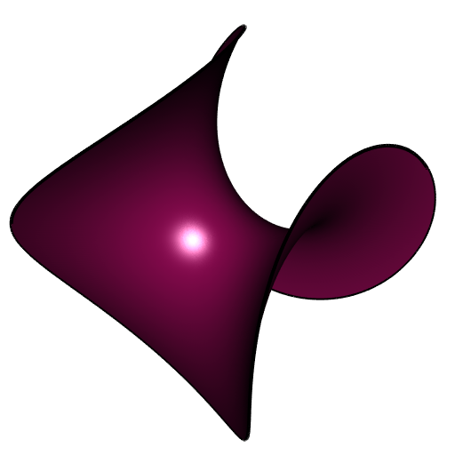
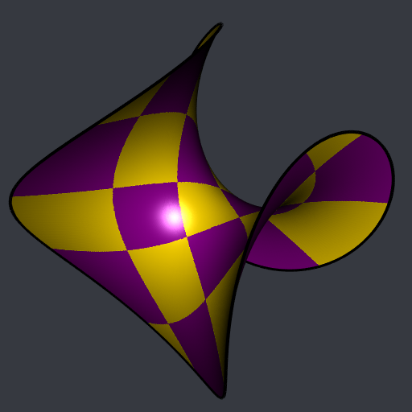
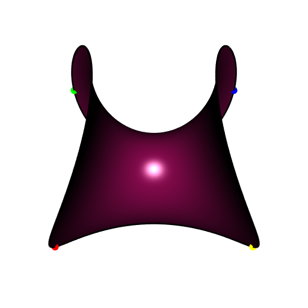

```{r setup, include=FALSE}
knitr::opts_chunk$set(collapse = TRUE)
```

In a 
[previous post](https://laustep.github.io/stlahblog/posts/Enneper-checkerboard.html), 
I showed how to use the **CGAL** parameterizations ported to my package 
**cgalMeshes** to decorate the Enneper surface of order three with a radial 
checkerboard.

Here I will show how to map an ordinary, square checkeboard on the Enneper 
surface of order two.

```{r EnneperMesh, message=FALSE}
library(cgalMeshes)
library(rgl)

# Enneper parameterization
n <- 2
Enneper <- function(phi, r) {
  rbind(
    r*cos(phi) - r^(2*n-1) * cos((2*n-1)*phi) / (2*n-1),
    r*sin(phi) + r^(2*n-1)*sin((2*n-1)*phi) / (2*n-1),
    2*r^n * cos(n*phi) / n
  )
}
# make mesh
rmesh <- parametricMesh(
  Enneper, urange = c(0, 2*pi), vrange = c(0, 1.2),
  periodic = c(TRUE, FALSE), nu = 512L, nv = 128L, clean = TRUE
)
# we extract the boundary; we will plot it multiple times
bndry <- getBoundary3d(rmesh, sorted = TRUE, color = "black")
```

```{r plotEnneper, eval=FALSE}
# plot the mesh
open3d(windowRect = 50 + c(0, 0, 512, 512), zoom = 0.8)
shade3d(rmesh, col = "deeppink4")
shade3d(bndry, lwd = 4)
```



Now we add some vertices to the mesh in order that the lines of the 
checkerboard that we will make later will be straight enough. We use the 
isotropic remeshing to do so, which does not change the shape of the mesh.
```{r isotropicRemeshing}
# convert to CGAL mesh ####
mesh <- cgalMesh$new(rmesh)
# take a look at the edge lengths
edges <- mesh$getEdges()
summary(edges[["length"]])
# add vertices in order that the checkeboard will have smooth lines ####
mesh$isotropicRemeshing(0.008, iterations = 3, relaxSteps = 2)
```

We first compute a DCP parameterization to make a checkerboard.

```{r DCPnoCorners}
# compute mesh DCP parameterization ####
UV <- mesh$parameterization(method = "DCP")
# the UV-space is the square [0,1]x[0,1]
# make square checkerboard with 5 squares x 5 squares ####
checkerboard <- ifelse(
  (floor(5 * UV[, 1L]) %% 2) == (floor(5 * UV[, 2L]) %% 2), 
  "gold", "magenta4"
)
# add normals, convert to 'rgl' mesh, and add colors ####
mesh$computeNormals()
rmesh <- mesh$getMesh()
rmesh[["material"]] <- list("color" = checkerboard)
```

```{r plotDCPcheckerboardNoCorners}
# plot ####
open3d(windowRect = 50 + c(0, 0, 512, 512), zoom = 0.8)
bg3d("#363940")
shade3d(rmesh, meshColor = "vertices", polygon_offset = 1)
shade3d(b, lwd = 4)
```



This mapped checkerboard is not very nice: the squares are not "aligned" 
with the mesh. The goal of the rest of this article is to construct a 
mapped checkerboard "aligned" with the mesh.


### First method: DCP with four fixed corners

The DCP parameterization allows to choose four vertices of the mesh which 
will be the four corners of the square space of the parameterization 
(the "UV-space"). 
We choose the four vertices which attain the extreme values of the $x$ 
coordinate:

```{r theFourCorners, eval=FALSE}
vs <- mesh$getVertices()
vsx <- vs[, 1L]
oinc <- order(vsx)
odec <- order(vsx, decreasing = TRUE)
vx1 <- oinc[1L]; vx2 <- oinc[2L]
vx3 <- odec[2L]; vx4 <- odec[1L]
# let's visualize these four vertices on the mesh
open3d(windowRect = 50 + c(0, 0, 512, 512))
view3d(0, -25, zoom = 0.8)
shade3d(rmesh, color = "deeppink4", polygon_offset = 1)
shade3d(bndry, lwd = 3)
points3d(rbind(vs[vx1, ]), col = "red",    size = 12)
points3d(rbind(vs[vx2, ]), col = "green",  size = 12)
points3d(rbind(vs[vx3, ]), col = "blue",   size = 12)
points3d(rbind(vs[vx4, ]), col = "yellow", size = 12)
```



Now let's compute the DCP parameterization with these given corners, 
let's make the checkerboard and let's plot the result:
```{r, eval=FALSE}
# compute the DCP parameterization with the four given corners ####
UV <- mesh$parameterization(method = "DCP", corners = c(vx1, vx2, vx3, vx4))
# make square checkerboard with 5 squares x 5 squares ####
checkerboard <- ifelse(
  (floor(5 * UV[, 1L]) %% 2) == (floor(5 * UV[, 2L]) %% 2), 
  "gold", "magenta4"
)
# add checkerboard colors to the 'rgl' mesh ####
rmesh[["material"]] <- list("color" = checkerboard)
# plot ####
open3d(windowRect = 50 + c(0, 0, 512, 512), zoom = 0.8)
bg3d("#363940")
shade3d(rmesh, meshColor = "vertices", polygon_offset = 1)
shade3d(bndry, lwd = 4)
```


Now you see what I mean by "align". It is quite better, no?


### Second method: ARAP parameterization
