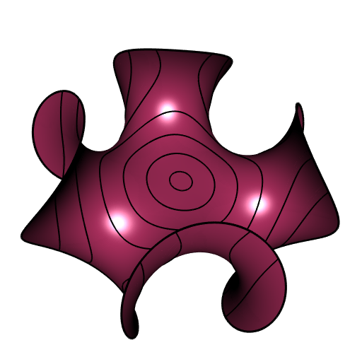
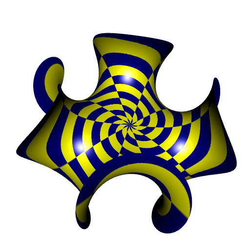
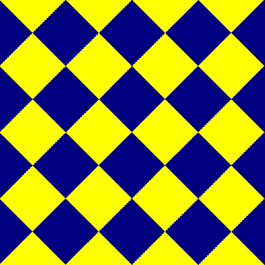
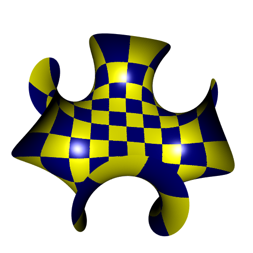
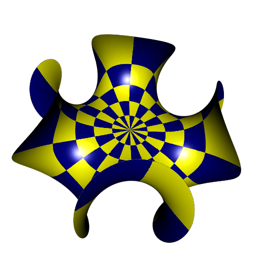
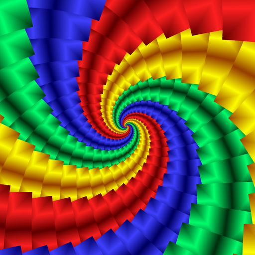
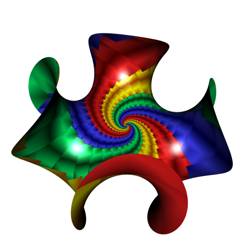

```{r, include = FALSE}
knitr::opts_chunk$set(
  collapse = TRUE,
  comment = "#>"
)
```

The **CGAL** library which is at the heart of this package provides some 
algorithms to construct *parameterizations* of surface meshes. 

Usually, what we call a parameterization of a mesh is a function of two 
variables `u` and `v`, say `p(u, v)`, which maps a 2D domain, usually a 
rectangle to the vertices of a surface mesh. This is exactly what is done by 
the function `parametricMesh` included in this package. 

Let's see an example of a parametric surface that we will use throughout this 
vignette, the 
[*Enneper surface*](https://mathcurve.com/surfaces.gb/enneper/enneper.shtml).

```{r Enneper-maroon}
library(cgalMeshes)
library(rgl)

# parameterization of the Enneper surface
Enneper <- function(phi, r, n = 4) {
  rbind(
    r*cos(phi) - r^(2*n-1) * cos((2*n-1)*phi) / (2*n-1),
    r*sin(phi) + r^(2*n-1) * sin((2*n-1)*phi) / (2*n-1),
    2*r^n * cos(n*phi)/n
  )
}
# do the mesh
rmesh <- parametricMesh(
  Enneper, urange = c(0, 2*pi), vrange = c(0, 1.1),
  periodic = c(TRUE, FALSE), nu = 512L, nv = 512L, clean = TRUE
)
rmesh <- addNormals(rmesh)
```

Now here is the code to plot it. We add its boundary and some contour lines 
because they are helpful for the visualization.

```{r plotEnneper-maroon, eval=FALSE}
open3d(windowRect = 50 + c(0, 0, 512, 512))
view3d(-10, -35, zoom = 0.7)
shade3d(rmesh, color = "maroon", polygon_offset = 1)
shade3d(
  getBoundary3d(
    rmesh, sorted = TRUE, color = "black", 
    lwd = 3, line_antialias = TRUE
  )
)
contourLines3d(
  rmesh, fn = function(x, y, z) sqrt(x^2 + y^2), 
  levels = seq(0.1, 1.1, by = 0.2), 
  plot = TRUE, lwd = 2, line_antialias = TRUE
)
```



This surface is parameterized by the `Enneper` function. So why would we want 
to use **CGAL** to get a parameterization? Well, this parameterization is not 
"nice", as you will see. First of all, what can we do with a parameterization? 
A parameterization allows to map a texture on the surface. Let's see. We are 
going to map a checkerboard on the Enneper surface. To do so, we don't need 
to use the `Enneper` function, because the vertices constructed by the 
`parametricMesh` function are well ordered. Here is the checkerboard:

```{r checkerboard, fig.width=5, fig.height=5, fig.align='center'}
u <- v <- seq(0, 1, length.out = 513L)[-513L]
Grid <- expand.grid(U = u, V = v)
checkerboard <- ifelse(
  (floor(10 * Grid$U) %% 2) == (floor(10 * Grid$V) %% 2), 
  "yellow", "navy"
)
opar <- par(mar = c(2, 2, 1, 1))
plot(
  Grid$U, Grid$V, type = "p", asp = 1, pch = ".", 
  col = checkerboard, xlab = "u", ylab = "v", axes = FALSE
)
axis(1); axis(2)
par(opar)
```

Now we assign these colors to the Enneper mesh:

```{r assign-checkboard-colors}
rmesh$material <- list(color = checkerboard)
```

And we plot the mesh:

```{r plotEnneper-checkerboard, eval=FALSE}
open3d(windowRect = 50 + c(0, 0, 512, 512))
view3d(-10, -35, zoom = 0.7)
shade3d(rmesh, meshColor = "vertices")
```



We previously said this parameterization is not "nice". Do you see why now? 
Well, the checkerboard mapped on the surface is really not similar to our 2D 
checkerboard: the lengths are not preserved, the angles are not preserved. 

A parameterization which preserves the angles is called a *conformal* 
parameterization. Let's see an example. I know a conformal parameterization 
of the torus:

```{r conformalTorus}
# the conformal torus mesh
torus_mesh <- function(R, r, nu, nv) {
  h <- R/r
  s <- sqrt(h*h - 1)
  f <- function(u, v) {
    w <- h - cospi(v)
    s * r * rbind(
      s * cospi(u) / w,
      s * sinpi(u) / w,
      sinpi(v) / w
    )
  }
  parametricMesh(
    f, urange = c(0, 2), vrange = c(0, 2), periodic = c(TRUE, TRUE), nu, nv
  )
}
TorusMesh <- addNormals(torus_mesh(R = sqrt(2), r = 1, nu = 1024L, nv = 1024L))
```

I take $R/r = \sqrt{2}$ ($\iff s=1$) to have a "square torus", 
on which we can map a square regular checkerboard. If you want to see 
how to deal with a rectangular torus, see the paper 
[Conformal Tiling on a Torus](https://static1.bridgesmathart.org/2011/cdrom/proceedings/134/paper_134.pdf)
This paper is the one in which I found the conformal parameterization.

Now we make a rotated checkerboard, that we will map to the torus surface.

```{r rotatedCheckerboard}
# make a grid of pairs (u, v) with as many pairs as the 
# number of vertices of the torus
x_ <- seq(0, 1, length.out = 1024L)
UV <- as.matrix(
  expand.grid(U = x_, V = x_)
)
# we need a rotation for the checkerboard
rotation <- function(alpha, uv) {
  t(rbind(
    c(cos(alpha), -sin(alpha)),
    c(sin(alpha),  cos(alpha))
  ) %*% t(uv))
}
# make the rotated checkerboard colors
UVrot <- rotation(pi/4, UV)
K <- 4*sqrt(2) # we want 4 rotated squares of length edge 1
               # (hence diagonal sqrt(2))
rotatedCheckerboardColors <- ifelse(
  (floor(K*UVrot[, 1L]) %% 2) == (floor(K*UVrot[, 2L]) %% 2),
  "yellow", "navy"
)
```

```{r plotRotatedCheckerboard, eval=FALSE}
# plot the rotated checkerboard
opar <- par(mar = c(0, 0, 0, 0))
plot(
  UV, col = rotatedCheckerboardColors, asp = 1, pch = ".", 
  xaxs = "i", yaxs = "i", axes = FALSE
)
par(opar)
```



Now we assign the colors to the vertices of the torus mesh, and we plot.

```{r}
# assign the rotated checkerboard colors to the torus mesh
TorusMesh[["material"]] <- list("color" = rotatedCheckerboardColors)
```

```{r plotTorus, eval=FALSE}
# plot the torus
open3d(windowRect = 50 + c(0, 0, 512, 512))
view3d(0, -40, zoom = 0.7)
shade3d(TorusMesh, meshColor = "vertices")
```


The parameterization is conformal.
It is not very obvious to see, but the right angles are not distorted 
(an angle on a curved surface is the angle between the tangents).
In fact, the boundaries of the yellow and blue squares form the *Villarceau 
circles* of the torus, shown in black on the following picture, and which are 
known to meet at right angles for the square torus.


Now we come back to the Enneper surface and we will use **CGAL**. Let's convert 
the **rgl** mesh to a `cgalMesh` mesh and let's have a look at the edge lengths:

```{r}
# convert the rgl mesh to cgalMesh
mesh <- cgalMesh$new(rmesh)
# look at the edge lengths
summary(mesh$getEdges()[["length"]])
```

If I constructed a parameterization with **CGAL** on this mesh to map the 
checkerboard, it would have irregular lines because there's not enough faces. 
Then we perform an isotropic remeshing to get smaller faces:

```{r isotropicRemeshing}
mesh$isotropicRemeshing(
  targetEdgeLength = 5e-3, iterations = 3L, relaxSteps = 2L
)
summary(mesh$getEdges()[["length"]])
```

Note that the isotropic remeshing does not change the shape of the mesh. 
Visually the mesh is the same as before.

Now we construct a parameterization. I choose the 
*discrete conformal parameterization*. This one tries to be conformal, that is 
to say it minimizes the distortion of the angles.

Of course **CGAL** will not give us a function. It will give us a matrix 
(`UV` below) with two columns, whose $i$-th row corresponds to the $u$ and $v$ 
coordinates of the $i$-th vertex of the mesh. There are two choices for the 
planar domain of the $uv$-coordinates: a square or a disk. I take the disk 
here.

```{r DCP}
UV <- mesh$parameterization(method = "DCP", UVborder = "circle")
head(UV)
```

Now we make a checkerboard with these points:

```{r DCPcheckerboard, fig.width=5, fig.height=5, fig.align='center'}
UVcheckerboard <- ifelse(
  (floor(10 * UV[, 1L]) %% 2) == (floor(10 * UV[, 2L]) %% 2), 
  "yellow", "navy"
)
opar <- par(mar = c(2, 2, 1, 1))
plot(
  UV[, 1L], UV[, 2L], type = "p", asp = 1, pch = ".", 
  col = UVcheckerboard, xlab = "u", ylab = "v", axes = FALSE
)
axis(1); axis(2)
par(opar)
```

Now let's assign these colors to the vertices of the mesh and let's plot it. 
We firstly compute the normals of the mesh and we convert it to a **rgl** mesh.

```{r computeNormals-getRGLmesh}
mesh$computeNormals()
rmesh <- mesh$getMesh()
rmesh$material <- list(color = UVcheckerboard)
```

```{r plotEnneperDCP, eval=FALSE}
open3d(windowRect = 50 + c(0, 0, 512, 512))
view3d(-10, -35, zoom = 0.7)
shade3d(rmesh, meshColor = "vertices")
```



Quite better, no?

But I personally prefer a radial checkerboard:

```{r radialCheckerboard, fig.width=5, fig.height=5, fig.align='center'}
UVnew <- UV - 0.5 # center the circle at (0,0)
radii <- sqrt(apply(10 * UVnew, 1L, crossprod))
angles <- 10 * (1 + atan2(UVnew[, 2L], UVnew[, 1L])/pi)
UVcheckerboard <- ifelse(
  floor(radii) %% 2 == 0,
  ifelse(
    floor(angles) %% 2 == 0, "navy", "yellow"
  ),
  ifelse(
    floor(angles) %% 2 == 0, "yellow", "navy"
  )
)
# plot
opar <- par(mar = c(2, 2, 1, 1))
plot(
  UV[, 1L], UV[, 2L], type = "p", asp = 1, pch = ".", 
  col = UVcheckerboard, xlab = "u", ylab = "v", axes = FALSE
)
axis(1); axis(2)
par(opar)
```

Then proceed as before. Here is the result:



As an exercise, you can do an animation: make the same picture but with the 
checkerboard rotating around its center.


# Mapping an image

Now let me show you how we can map an image to the mesh. I take this spiral:



This time, we compute the discrete conformal parameterization with a square 
$uv$-space. I redo the mesh before because we will not use the isotropic 
remeshing.

```{r squareDCP}
rmesh <- parametricMesh(
  Enneper, urange = c(0, 2*pi), vrange = c(0, 1.1),
  periodic = c(TRUE, FALSE), nu = 512, nv = 512, clean = TRUE
)
mesh <- cgalMesh$new(rmesh)
mesh$computeNormals()
# construct the square DCP parameterization
UV <- mesh$parameterization(method = "DCP", UVborder = "square")
```

Let's extract the colors from the spiral with the help of the **imager** 
package:

```{r imager, message=FALSE}
library(imager)
# load the image
img <- load.image("spiral512x512.png")
# take the r, g, b channels
r <- squeeze(R(img))
g <- squeeze(G(img))
b <- squeeze(B(img))
```

This image has $512$ pixels $\times$ $512$ pixels, like the vertices of our mesh. 
We make a regular $512 \times 512$ grid of the square ${[0,1]}^2$ and we 
construct three interpolating functions on this grid for the `r`, `g`, `b` we 
just extracted. Why? Because we will use these interpolating functions to get 
the colors of the $uv$-coordinates.

```{r interpolate}
library(cooltools) # to get the `approxfun2` function
x_ <- y_ <- seq(0, 1, length.out = 512L)
f_r <- approxfun2(x_, y_, r)
f_g <- approxfun2(x_, y_, g)
f_b <- approxfun2(x_, y_, b)
# now, interpolate the r, g, b values
UV_r <- f_r(UV[, 1L], UV[, 2L])
UV_g <- f_g(UV[, 1L], UV[, 2L])
UV_b <- f_b(UV[, 1L], UV[, 2L])
# convert rgb to hex codes
spiral <- rgb(UV_r, UV_g, UV_b)
# we're done; now compute mesh normals, convert to rgl mesh, and assign colors
rmesh <- mesh$getMesh()
rmesh$material <- list(color = spiral)
```

```{r Enneper-spiral, eval=FALSE}
open3d(windowRect = 50 + c(0, 0, 512, 512))
view3d(-10, -35, zoom = 0.7)
shade3d(rmesh, meshColor = "vertices")
```




